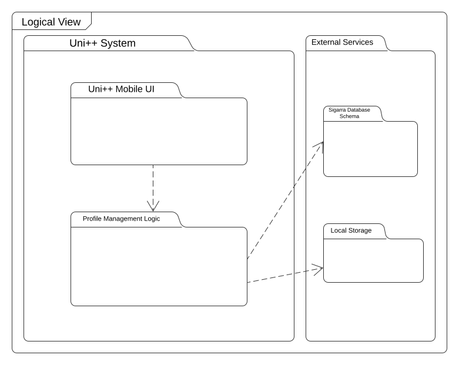
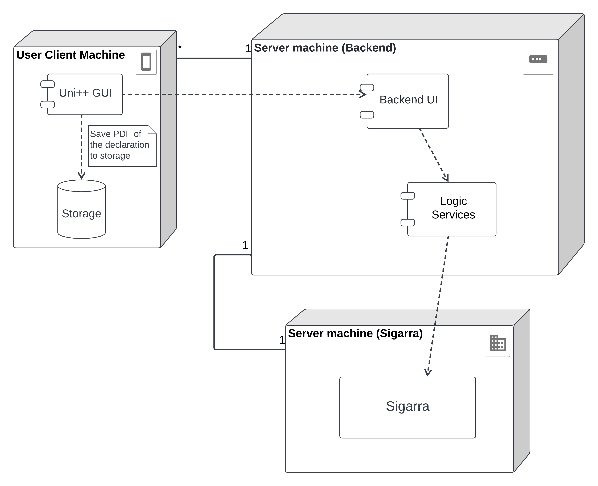

# Architecture and Design

## Logical architecture

  

- `Uni++ Mobile UI`: viewing application pages;
- `Profile Management Logic`: manipulation and management of user data;
- `Sigarra DataBase Schema`: where some of the data necessary for the application are stored;
- `Local Storage`: where the data from the downloads are stored

## Physical architecture

 The physical architecture diagram shows three nodes, which represent the physical devices involved in the project and how it is connected.
 
  The first node is the User Client device, it is represented by the Uni++ Application component and the device's internal storage, which is used to save the PDF file generated by the application.
    
The second node is the Server Machine, which runs the backend for the Uni++ application. It serves as an interface between the User Client device and the Sigarra Server machine, receiving the user requests and providing the expected services, by communicating with Sigarra's Server and then responding to that requests.
    
The last node is the Sigarra Server Machine, which is supposed to provide the requested information for the services. It is a black-box node by the fact that the technologies it uses are unknown.
    

  

## Vertical prototype

The vertical prototype shows bare bones test app with basic functionalities we will need to use Flutter to perform.

This is a simple page with (and reasons below):

- A menu button (there is no menu at the moment);

- A pop up window that is used to change the username in the "Hi, $username!";
  > needed for showing more options, for example, editing profile's attribute and showing edition status of said attributes
  >
  > working with variables and user input

- A button that downloads an image from the internet to the mobile phone storage;
  > Uni++ will have the functionality to download multipurpose declarations. We wanted to verify the ability of doing it

- Other basic functionality like adding an image (the Uni++ logo), and working out a simple UI;

#### Demonstration of the prototype:

