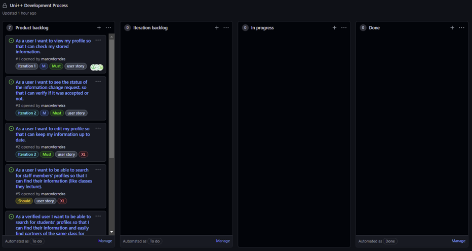
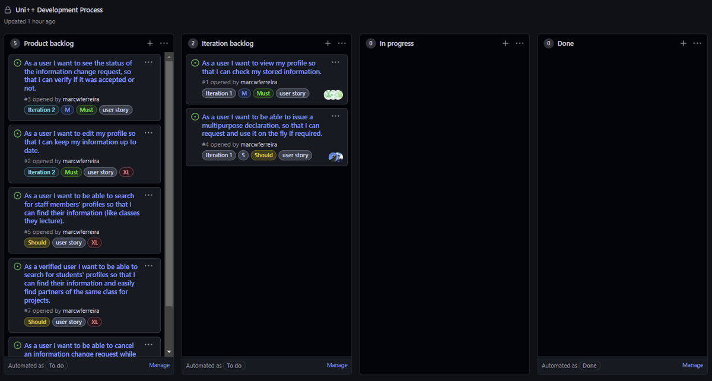
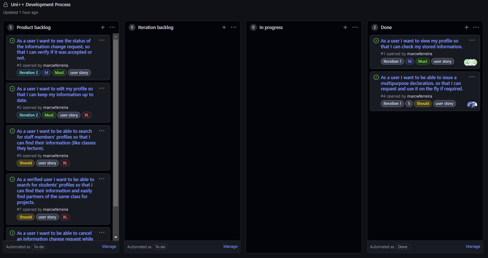
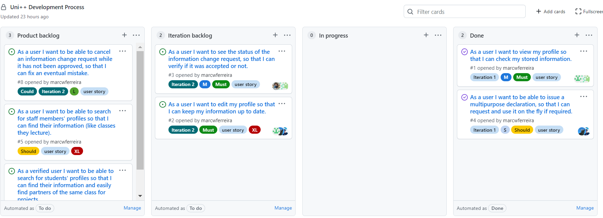
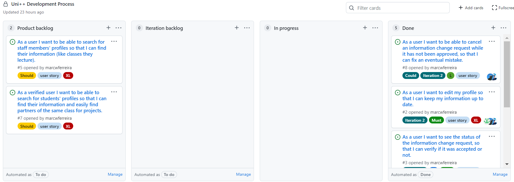
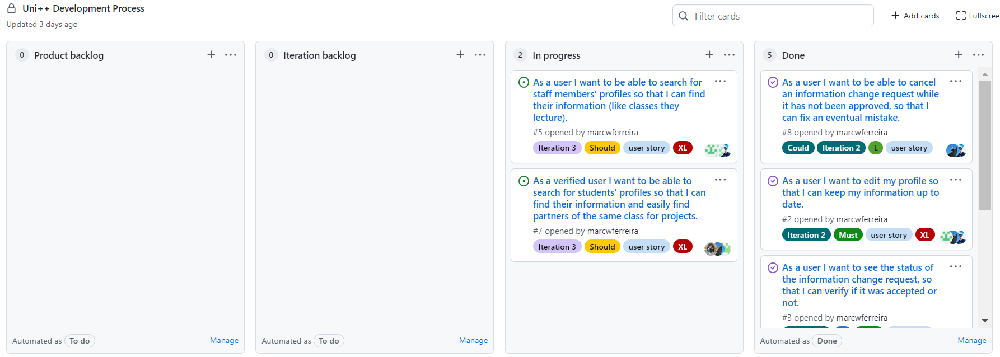
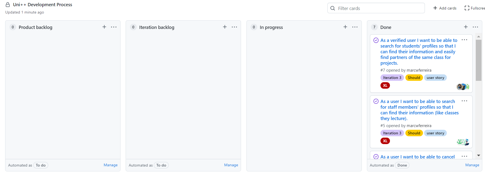

## Project management

You can find below information and references related with the project management in our team: 

* Backlog management: Product backlog and Iteration backlog in a [Github Projects board](https://github.com/LEIC-ES-2021-22/2LEIC05T2/projects/1);
* Release management: 
  * [v0.0](https://github.com/LEIC-ES-2021-22/2LEIC05T2/releases/tag/v0.0)
  * [v1.0](https://github.com/LEIC-ES-2021-22/2LEIC05T2/releases/tag/v1.0)
  * [v2.0](https://github.com/LEIC-ES-2021-22/2LEIC05T2/releases/tag/v2.0)
  * [v3.0](https://github.com/LEIC-ES-2021-22/2LEIC05T2/releases/tag/v3.0)

* Iteration planning and retrospectives:

> ## Iteration 0
>
> ### * Plans:
>
>   > ### Development Board
>   >
>   >Beginning
>   >
>   >
>   >
>   >End
>   >
>   >
>
> ### * Retrospectives: 
>
>  > This iteration does not add any functionalities to the application. It is essentially a vertical prototype used to test the different technologies that will be used and if they are enough for the propose of Uni++.  
>

 

> ## Iteration 1
>
> ### * Plans:
>
>   > ### Development Board
>   >
>   >Beginning
>   >
>   >
>   >
>   >End
>   >
>   >
>
> ### * Retrospectives: 
>
>  > In this iteration we did:
>  > - Visualization of personnal information; 
>  > - Multipurpose Declaration request page;
> 
>  > What went well?
>  > - Divinding the group and assigning different tasks to different groups (a feature for each)
>  > - In our meetings we worked together using VSCode live share
>
>  > What didn't go so well?
>  > - Few meetings with the whole group regarding all the work implementation
>  > - Starting thinking about the tesk too late, afteer work on the iteration had started
>
>  > What have I learned?
>  > - More and better communication, meaning, scheduling meetings and discussions more often;
>  > - Smaller meetings more often instead of fewer larger ones; 
>  > - Better planning, setting deadlines for subtasks' defined; 
>  > - More thought-out testing;
>
>  > What still puzzles me?
>  > - Workflow on flutter and its characteristics
>
>     

> ## Iteration 2
>
> ### * Plans:
>  > ### Development Board
>  >
>  >Beginning
>  >
>  > 
>  >
>  >End
>  >
>  > 
>
> ### * Retrospectives:
>
>  > In this iteration we did:
>  > - Added a icon to allow to user to edit the information of the profile
>  > - Added a icon to allow to user to see the status of the alteration's request
>  > - Added a pop up that allow users to changes profile's information
>  > - Added a pop up that allow users to view the profile change request information while pending and cancel it
>  > - Added a pop up that allow users to view the profile change request information after accpetd or rejected and clear notification
> 
>  > What went well?
>  > - Meetings more frequently and adapted to be more compatbile with the scheduele of the group
>  > - We continued to use live share since it was a good idea at the last iteration and allows all group members to work together
>  > - One more issue was implemented since the work was finished early (it was not planned to this iteration)
>  > - Started thinking about the test before hand and how to implement them after a feature was completed
>
>  > What didn't go so well?
>  > - Despite having more meetings, they were long and tiring
>
>  > What have I learned?
>  > - Smaller meetings or a little break in them
>  > - Test features on more devices before finishing them
>  > - Not only think aboute the tests and how to implement them but implement them as we add features
>
>  > What still puzzles me?
>  > - N/A
>
>   

> ## Iteration 3
>
> ### * Plans:
>  > ### Development Board
>  >
>  >Beginning
>  >
>  > 
>  >
>  >End
>  >
>  > 
>
> ### * Retrospectives:
>
>  > In this iteration we did:
>  > - Added a feature to search Faculty's students and staff
>  > - Logged in users can search for students and staff
>  > - Users not logged in may only search for staff
>  > - Added a section in navigation drawer leading to the new search page
>  > - Added a link in the login page leading to the search page
>  > - When selecting a person from the search result it opens a new page that shows detailed information about them
> 
>  > What went well?
>  > - We continued to use live share since it was a good idea at the two lasts iterations and allows all group members to work together and contribute
>  > - We implemented all features that we proposed in beginning of semester
>
>  > What didn't go so well?
>  > - In this iteration we couldn't find a schedule for all meetings that works for all of the elements of the group
>
>  > What have I learned?
>  > - We learn how to work with json
>
>  > What still puzzles me?
>  > - we had some difficulties working with the controllers in flutter
>
>     