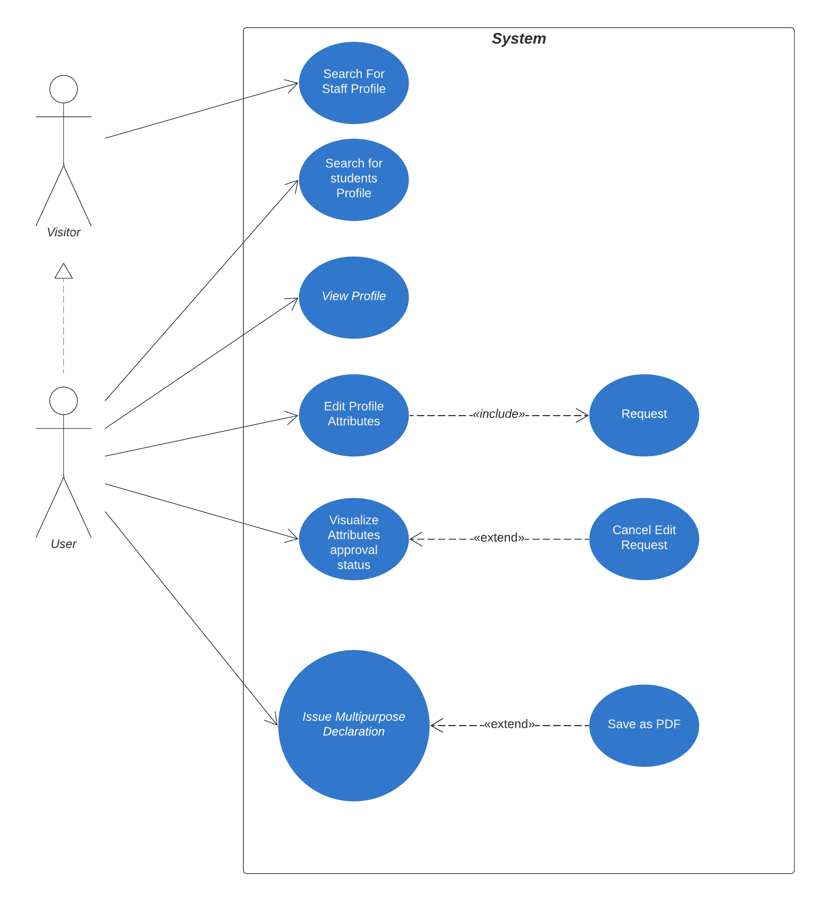
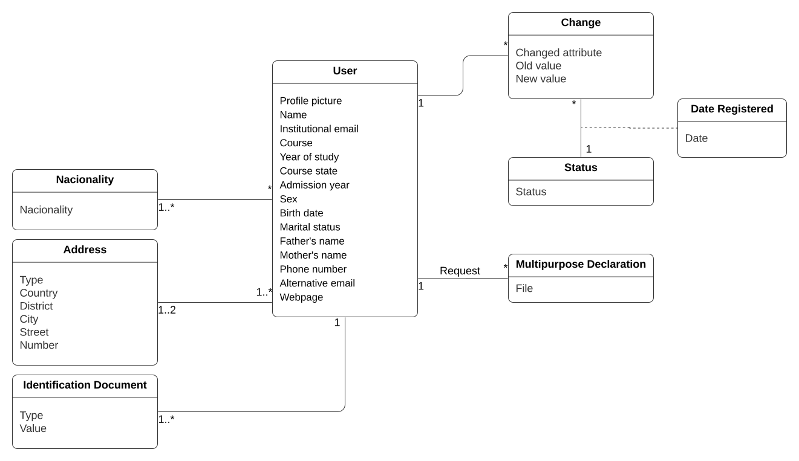

## Requirements

### Use case model 

 

  

#### Use case 1

<table>
  <tr>
   <td>Name
   </td>
   <td>Search For Staff Profile
   </td>
  </tr>
  <tr>
   <td>Actor
   </td>
   <td>Visitor (an user not logged in)
   </td>
  </tr>
  <tr>
   <td>Description
   </td>
   <td>An user can search for any FEUP staff member and then visualize their information (for example: e-mail)
   </td>
  </tr>
  <tr>
   <td>Preconditions
   </td>
   <td>
<ul>

<li>The user must have internet connection
</li>
</ul>
   </td>
  </tr>
  <tr>
   <td>Postconditions
   </td>
   <td>
<ul>

<li>A list of possible results is shown to the user. Choosing one will show a page with the chosen profile’s information.
</li>
</ul>
   </td>
  </tr>
  <tr>
   <td>Normal flow
   </td>
   <td>
<ol>

<li>User starts at the search screen

<li>The user selects the search bar

<li>The user insert the name or number of the staff member desired

<li>The application shows a list of possible results
</li>
</ol>
   </td>
  </tr>
  <tr>
   <td>Alternative flows and exceptions
   </td>
   <td>Failed search. If a list of results cannot be loaded an user will be shown a message of the failure and will be able to search again afterwards.
   </td>
  </tr>
</table>

#### Use case 2

<table>
  <tr>
   <td>Name
   </td>
   <td>Search for students Profile 
   </td>
  </tr>
  <tr>
   <td>Actor
   </td>
   <td>User
   </td>
  </tr>
  <tr>
   <td>Description
   </td>
   <td>The user can search and view the public information of the profile of any other registered Sigarra user. (e.g. name, institutional email, profile picture…)
   </td>
  </tr>
  <tr>
   <td>Preconditions
   </td>
   <td>
<ul>

<li>The user must be logged in with their Sigarra account.
</li>
</ul>
   </td>
  </tr>
  <tr>
   <td>Postconditions
   </td>
   <td>
<ul>

<li>The user views the intended user profile, with only its public information available.
</li>
</ul>
   </td>
  </tr>
  <tr>
   <td>Normal flow
   </td>
   <td>
<ol>

<li>User accesses the main page and logs in if not already

<li>User selects "Pesquisar Pessoal"

<li>Search page is shown to the user

<li>User clicks the search bar

<li>User introduces the name or student number of the pretended student

<li>The app shows the intended page
</li>
</ol>
   </td>
  </tr>
  <tr>
   <td>Alternative flows and exceptions
   </td>
   <td>Failed search. In case step 3 doesn’t find a match, show an error message and give the user the opportunity to search again.
   </td>
  </tr>
</table>

#### Use case 3

<table>
  <tr>
   <td>Name
   </td>
   <td>View Profile
   </td>
  </tr>
  <tr>
   <td>Actor
   </td>
   <td>User
   </td>
  </tr>
  <tr>
   <td>Description
   </td>
   <td>Users can see their own profile, so they have access to their personal information.
   </td>
  </tr>
  <tr>
   <td>Preconditions
   </td>
   <td>
<ul>

<li>The user has to be logged in to have access to profile
</li>
</ul>
   </td>
  </tr>
  <tr>
   <td>Postconditions
   </td>
   <td>
<ul>

<li>A page with the user profile information will be shown
</li>
</ul>
   </td>
  </tr>
  <tr>
   <td>Normal Flow
   </td>
   <td>
<ol>

<li>User accesses the initial page of the app and clicks on the Login button.

<li>User enters with valid credentials.

<li>The system redirects the user to their Profile page.

<li>In case the user is already logged in, they can return to profile by clicking on Profile button.
</li>
</ol>
   </td>
  </tr>
  <tr>
   <td>Alternative flows and exceptions
   </td>
   <td>If the user profile couldn’t be loaded a page telling the user their information couldn’t be loaded is shown
   </td>
  </tr>
</table>

#### Use case 4

<table>
  <tr>
   <td>Name
   </td>
   <td>Edit Profile Attributes
   </td>
  </tr>
  <tr>
   <td>Actor
   </td>
   <td>User
   </td>
  </tr>
  <tr>
   <td>Description
   </td>
   <td>An user will be able to access and edit profile page, where they will be able to change and save their information. 

   Profile changes send a request to Sigarra, therefore it is included a request module.
   </td>
  </tr>
  <tr>
   <td>Preconditions
   </td>
   <td>
<ul>

<li>The user needs an internet connection and to be logged in 
</li>
</ul>
   </td>
  </tr>
  <tr>
   <td>Postconditions
   </td>
   <td>
<ul>

<li>The user will receive a notification that their information request was sent and a widget with their request status will be shown next to the information changed. If university validation is not needed, the information will be updated at the moment of the request
</li>
</ul>
   </td>
  </tr>
  <tr>
   <td>Normal flow
   </td>
   <td>
<ol>

<li>User will start the application and log in

<li>The user selects their profile page

<li>The application shows the user profile page

<li>The user clicks edit button of the desired attribute to change

<li>User is shown an edit window

<li>User introduces the change

<li>User clicks apply and the request is sent

<li>The edit window closes

<li>When user has finished the changes they can select “Save/ request changes”
</li>
</ol>
   </td>
  </tr>
  <tr>
   <td>Alternative flows and exceptions
   </td>
   <td>Invalid modification. In step 4, in case invalid information is introduced (e.g. text in a numerical attribute), show an error message and give the user the possibility to try again.

Failure to send change request. In step 5, if an error occurs, a message will be shown indicating that changes were unable to be processed and the user may try again later.
   </td>
  </tr>
</table>

#### Use case 5

<table>
  <tr>
   <td>Name
   </td>
   <td>Visualize profile modification approval status
   </td>
  </tr>
  <tr>
   <td>Actor
   </td>
   <td>User
   </td>
  </tr>
  <tr>
   <td>Description
   </td>
   <td>The user can verify the statuses of the latest profile modifications. (If they have been approved, rejected, or are still being processed)
   </td>
  </tr>
  <tr>
   <td>Preconditions
   </td>
   <td>
<ul>

<li>The user must have internet connection
</li>
</ul>
   </td>
  </tr>
  <tr>
   <td>Postconditions
   </td>
   <td>
<ul>

<li>The statuses of the latest profile modifications are shown to the user.
</li>
</ul>
   </td>
  </tr>
  <tr>
   <td>Normal Flow
   </td>
   <td>
<ol>

<li>User accesses the main page and logs in if not already.

<li>User accesses their profile

<li>For each attribute, if they have been recently modified, show the current status of the request.
</li>
</ol>
   </td>
  </tr>
  <tr>
   <td>Alternative flows and exceptions
   </td>
   <td>Not applicable
   </td>
  </tr>
</table>

#### Use case 6

<table>
  <tr>
   <td>Name
   </td>
   <td>Issue Multipurpose Declaration
   </td>
  </tr>
  <tr>
   <td>Actor
   </td>
   <td>User
   </td>
  </tr>
  <tr>
   <td>Description
   </td>
   <td>An easy way for users to have access to the multipurpose declaration, having the option to save it as PDF.
   </td>
  </tr>
  <tr>
   <td>Preconditions
   </td>
   <td>
<ul>

<li>The user has to be logged-in

<li>The user has to be enrolled in a cycle of studies on UPorto
</li>
</ul>
   </td>
  </tr>
  <tr>
   <td>Postconditions
   </td>
   <td>
<ul>

<li>May be necessary to validate this document and verify that its digital signature is valid
</li>
</ul>
   </td>
  </tr>
  <tr>
   <td>Normal Flow
   </td>
   <td>
<ol>

<li>The user accesses the initial page of the app.

<li>The user selects the button Issue multipurpose declaration.

<li>The system will generate the declaration using the user's information.

<li>The user has the option to save the declaration as PDF.
</li>
</ol>
   </td>
  </tr>
  <tr>
   <td>Alternative flows and exceptions
   </td>
   <td>Not applicable
   </td>
  </tr>
</table>
 

### Domain model 

 

  

The profile user contains profile picture, name, institutional email, course, year of study, course state, admission year, sex, birth date, marital status, mather's name, mother's name, phone number, alternative email and web page.  

Each user can have more than one nacionality, at most twice addresses and multiple identification documents registered on profile. The user will be able to modify their information, which is associated with an approval status and an edition date. Besides that, each user can request their multipurpose declaration.